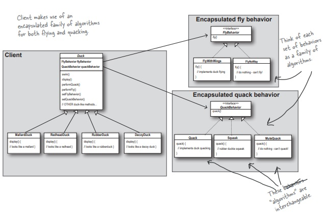

# Strategy Pattern



## 정의
```
- 알고리즘군을 정의하고 각각을 캡슐화하여 교환해서 사용할수있도록 만든다.
- 클라이언트와는 독립적으로 알고리즘 변경가능
```

## 사용된 원칙
```
1. 애플리케이션에서 달라지는 부분을 찾아내고, 달라지지 않는 부분으로부터 분리
2. 구현이 아닌 인터페이스에 맞춰서 프로그래밍한다
3. 상속보다는 구성을 활용한다.
```

## 문제상황과 해결
```
문제 : 오리 시뮬레이션게임
- Duck클래스를 상속받아 다양한 오리들을 만들었다, 오리들은 소리를 내거나 수영을 한다.
- 오리들이 날아다닐수 있도록 해달라는 요구사항이 생김.
- Duck에 Fly라는 매서드를 추가하자, 장난감 오리처럼 날지 못하는 오리들도 날기 시작

해결
- 달라지는 부분인 fly와 quack 메서드를 빼서 행동 클래스집합을 새로 만든다.
- 오리는 직접 메서드를 통해 행동하는 것이 아닌 행동이라는 상위 클래스를 사용
- 행동을 행동 클래스에 위임(delegation)한다.
- 후에 행동이 추가되거나 내용이 바뀌어도 오리쪽에서 수정할 필요가 없어진다.

```

## Example
```
Sorting알고리즘을 생각해보자.
데이터를 정리하는데 A라는 알고리즘을 쓰다가 성능개선을 위해 B라는 알고리즘으로 바꾸려한다.
이때 A의 정렬방법을 B에 맞추어서 코드를 전부 바꿔야 할까?
Strategy Pattern을 이용해서 정렬 알고리즘이라는 상위 클래스에 맞추어서 프로그램을 만들게 되면
A에서 B로 알고리즘이 바뀌어도 프로그램을 수정하지 않아도 된다.
```
